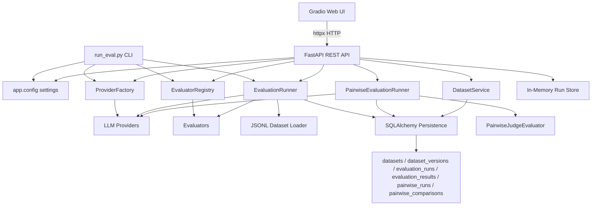
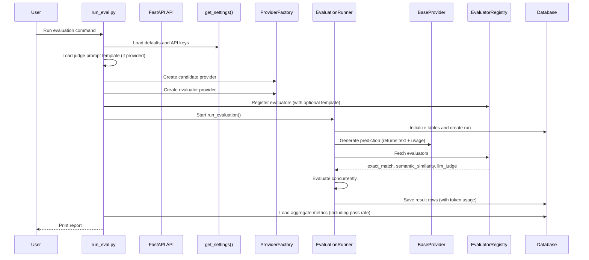
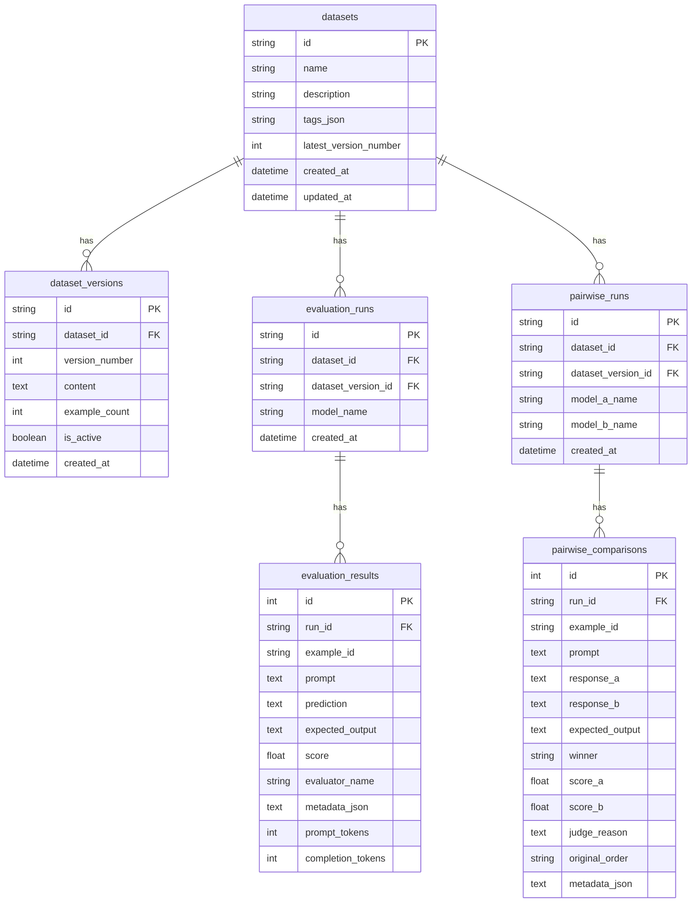

# LLM Evaluation Engine - Project Documentation

## 1. Project Overview

The LLM Evaluation Engine is a Python-based framework for evaluating language model outputs against structured datasets. It generates model predictions through a provider abstraction, evaluates them with multiple metrics, persists every run and result to a database, and exposes the entire pipeline through a CLI, a REST API, and a Gradio web UI.

The project supports both real LLM providers and mock provider execution, making it useful for local development, CI testing, dry runs, and production-style model comparison workflows. It includes single-model evaluation, pairwise model comparison with Elo ratings, and full dataset management with versioning.

### Primary Goals

- Load structured evaluation examples from JSONL datasets.
- Generate model predictions through a unified provider abstraction.
- Evaluate predictions with multiple metrics (exact match, semantic similarity, LLM-as-a-judge).
- Compare two models side-by-side with pairwise evaluation and Elo ratings.
- Manage datasets with full CRUD, versioning, file upload, tagging, and search.
- Run examples asynchronously with configurable concurrency.
- Store datasets, evaluation runs, pairwise runs, and individual results in SQLite.
- Expose the evaluation pipeline through a REST API (FastAPI).
- Provide an interactive web UI (Gradio) for non-technical users.
- Support mock mode for development and testing without API keys.
- Provide a modular architecture for adding new providers and evaluators.

## 2. Technology Stack

### Language and Runtime

- **Python 3.10+**: Core application language.
- **asyncio**: Used for concurrent provider generation and evaluator execution.

### Configuration

- **pydantic-settings**: Loads typed settings from environment variables and `.env`.
- **Pydantic v2**: Validates settings, application schemas, and API request/response models.
- **`.env` file**: Local configuration source for API keys, database URL, defaults, and model settings.

### Data Validation

- **Pydantic**:
  - Validates dataset records through `EvaluationExample`.
  - Validates evaluator outputs through `EvaluationResult`.
  - Validates LLM judge responses through `JudgeResponse`.
  - Validates pairwise judge responses through `PairwiseJudgeResponse`.
  - Validates API request/response payloads through custom schemas.

### Persistence

- **SQLAlchemy 2.x ORM**:
  - Defines database models.
  - Manages engine and sessions.
  - Persists datasets, dataset versions, runs, pairwise runs, and evaluation results.
- **SQLite**:
  - Default database backend.
  - Stored in `evals.db` unless overridden by `DATABASE_URL`.

### LLM Provider SDKs

- **OpenAI SDK**: Used by `OpenAIProvider`.
- **Anthropic SDK**: Used by `AnthropicProvider`.
- **google-generativeai**: Used by `GeminiProvider`.
- **Cohere SDK**: Used by `CohereProvider`.

### Web Framework

- **FastAPI**: REST API layer with automatic OpenAPI docs.
- **Uvicorn**: ASGI server for running the FastAPI application.
- **httpx**: Async HTTP client used by the Gradio UI to communicate with the API.

### Web UI

- **Gradio**: Interactive web interface with four tabs for triggering evaluation runs, pairwise comparisons, and viewing results.

### Evaluation and ML Libraries

- **sentence-transformers**:
  - Used by semantic similarity evaluation when available.
  - Defaults to `all-MiniLM-L6-v2`.
- **numpy**:
  - Listed as a numerical dependency used by ML-related packages.
- **json_repair**:
  - Used by the pairwise judge evaluator and dataset service to handle malformed JSON from LLMs and uploaded files.

### Structured Logging

- **structlog**: Structured logging throughout all modules. Each module creates a module-level logger via `log = structlog.get_logger()`.

### Testing

- **pytest**: Test runner.
- **pytest-asyncio**: Async test support.
- **SQLAlchemy test database overrides**: Tests isolate database state by replacing the runtime database engine with a temporary SQLite file.

## 3. Repository Structure

```text
.
+-- app/
|   +-- config.py
|   +-- database/
|   |   +-- connection.py
|   |   +-- models.py
|   +-- evaluators/
|   |   +-- base.py
|   |   +-- base_pairwise.py
|   |   +-- exact_match.py
|   |   +-- llm_judge.py
|   |   +-- pairwise_judge.py
|   |   +-- registry.py
|   |   +-- similarity.py
|   +-- providers/
|   |   +-- anthropic.py
|   |   +-- base.py
|   |   +-- cohere.py
|   |   +-- factory.py
|   |   +-- gemini.py
|   |   +-- openai.py
|   +-- runners/
|   |   +-- eval_runner.py
|   |   +-- pairwise_runner.py
|   +-- schemas/
|   |   +-- example.py
|   |   +-- result.py
|   +-- services/
|   |   +-- dataset_service.py
|   +-- api/
|   |   +-- __init__.py
|   |   +-- main.py
|   |   +-- schemas.py
|   +-- ui/
|       +-- __init__.py
|       +-- gradio_app.py
+-- datasets/
|   +-- sample.jsonl
+-- tests/
|   +-- conftest.py
|   +-- test_config.py
|   +-- test_dataset_api.py
|   +-- test_dataset_service.py
|   +-- test_evaluators.py
|   +-- test_pairwise.py
|   +-- test_providers.py
|   +-- test_runner.py
+-- .env.example
+-- .gitignore
+-- README.md
+-- PROJECT_DOCUMENTATION.md
+-- feature-pairwise_model_evaluation.md
+-- requirements.txt
+-- run_eval.py
+-- evals.db
```

## 4. High-Level Architecture

The engine follows a layered architecture with three entry points (CLI, REST API, Gradio UI) sharing the same core evaluation pipeline:



### Architectural Style

- **Three entry points**: CLI (`run_eval.py`), REST API (`app/api/main.py`), Gradio UI (`app/ui/gradio_app.py`).
- **Provider abstraction**: All LLM integrations implement `BaseProvider`.
- **Evaluator abstraction**: All metrics implement `BaseEvaluator` (single-model) or `BasePairwiseEvaluator` (pairwise).
- **Registry pattern**: `EvaluatorRegistry` centralizes active evaluators.
- **Factory pattern**: `ProviderFactory` centralizes provider creation and alias handling.
- **Service layer**: `DatasetService` encapsulates dataset CRUD, versioning, and search logic.
- **Repository-like persistence boundary**: Database access is grouped through SQLAlchemy models and session helpers.
- **Typed schema boundary**: Pydantic models validate input and output data between layers.
- **In-memory run tracking**: The API layer tracks run status in a dict, with fallback to database for CLI-initiated runs.

## 5. Runtime Execution Flow

### Step-by-Step Flow (CLI)

1. The user runs `python run_eval.py`.
2. CLI arguments are parsed.
3. Defaults are loaded from `.env` through `get_settings()`.
4. If `--judge-prompt-template` is provided, the template file is loaded from disk.
5. The dataset is loaded from a JSONL file.
6. Candidate provider is created through `ProviderFactory`.
7. Evaluator provider is created through `ProviderFactory`.
8. `EvaluatorRegistry` registers default evaluators, passing the optional judge prompt template.
9. `EvaluationRunner` initializes database tables.
10. A dataset record and evaluation run record are created.
11. Each example is processed asynchronously.
12. The provider generates a prediction for each prompt, returning `(text, usage)` tuples.
13. All registered evaluators evaluate the prediction.
14. Token usage from the provider is recorded alongside each result.
15. Results are persisted to `evaluation_results`.
16. Aggregated metrics (including pass rate) are queried and printed to the terminal.

### Step-by-Step Flow (REST API)

1. The user sends a `POST /runs` request with evaluation parameters.
2. The API validates the request body using `RunRequest` (Pydantic v2).
3. The dataset is loaded and validated.
4. Candidate and evaluator providers are created through `ProviderFactory`.
5. A pre-assigned run ID is returned immediately to the caller.
6. The actual evaluation runs as a background task via `asyncio.create_task`.
7. On completion, the run status is updated in the in-memory store.
8. The user polls `GET /runs/{run_id}` to check status and retrieve metrics.

### Step-by-Step Flow (Pairwise REST API)

1. The user sends a `POST /pairwise-runs` request with parameters for both models and a judge.
2. The API validates the request body using `PairwiseRunRequest`.
3. The dataset is loaded and validated.
4. Providers for Model A, Model B, and the Judge are created through `ProviderFactory`.
5. A `PairwiseJudgeEvaluator` and `PairwiseEvaluationRunner` are instantiated.
6. A pre-assigned run ID is returned immediately.
7. The pairwise evaluation runs as a background task.
8. For each example, both models generate responses concurrently, the order is randomized, the judge compares them, and the winner is un-swapped if needed.
9. After all examples, win/loss/tie rates and Elo ratings are computed.
10. The user polls `GET /pairwise-runs/{run_id}` to check status and retrieve metrics.

### Step-by-Step Flow (Gradio UI)

1. The user fills in the evaluation form in the Gradio interface.
2. On submit, the UI sends a `POST /runs` or `POST /pairwise-runs` request to the FastAPI server via `httpx`.
3. The returned `run_id` and status are displayed.
4. The user switches to the appropriate "View Results" tab, enters the `run_id`, and clicks "Fetch Results".
5. The UI sends a `GET /runs/{run_id}` or `GET /pairwise-runs/{run_id}` request and displays status and metrics.

### Detailed Pipeline



## 6. Configuration Design

Configuration is centralized in `app/config.py`.

### Settings Source

The application reads configuration from:

1. Environment variables.
2. The local `.env` file.
3. Field defaults in `Settings`.

### Main API

```python
from app.config import get_setting, get_settings

settings = get_settings()
database_url = settings.database_url
openai_key = settings.openai_api_key

concurrency = get_setting("DEFAULT_CONCURRENCY")
```

### Supported Variables

| Variable | Purpose | Default |
| --- | --- | --- |
| `DATABASE_URL` | SQLAlchemy database URL | `sqlite:///evals.db` |
| `OPENAI_API_KEY` | OpenAI API key | empty |
| `ANTHROPIC_API_KEY` | Anthropic API key | empty |
| `GEMINI_API_KEY` | Gemini API key | empty |
| `GOOGLE_API_KEY` | Alternate Gemini key | empty |
| `COHERE_API_KEY` | Cohere API key | empty |
| `DEFAULT_CANDIDATE_PROVIDER` | Default model provider | `openai` |
| `DEFAULT_CANDIDATE_MODEL` | Default candidate model | `mock` |
| `DEFAULT_EVALUATOR_PROVIDER` | Default judge provider | `openai` |
| `DEFAULT_EVALUATOR_MODEL` | Default judge model | `mock` |
| `DEFAULT_CONCURRENCY` | Parallel evaluation limit | `3` |
| `SIMILARITY_MODEL_NAME` | SentenceTransformer model | `all-MiniLM-L6-v2` |

## 7. Dataset Design

Datasets are JSONL files. Each line is one evaluation example.

### Required Fields

| Field | Type | Description |
| --- | --- | --- |
| `id` | string | Unique example identifier. If omitted, the loader generates `example_<line_number>`. |
| `input` | string | Prompt or model input. |
| `expected_output` | string | Ground truth output used by evaluators. |

### Optional Fields

| Field | Type | Description |
| --- | --- | --- |
| `metadata` | object | Arbitrary dataset metadata such as category, difficulty, tags, or source. |

### Example

```json
{"id": "q1", "input": "What is the capital of France?", "expected_output": "Paris", "metadata": {"category": "geography"}}
```

### Dataset Versioning

Datasets support immutable versioning. Each time a dataset is updated, a new version is created. Only one version can be "active" at a time. Evaluation runs reference the dataset version used, ensuring reproducibility.

## 8. Core Modules

### `run_eval.py`

The CLI entry point. Responsibilities:

- Parse runtime arguments.
- Load settings.
- Resolve backward-compatible `--model` syntax.
- Create candidate and evaluator providers.
- Create the evaluator registry.
- Run the evaluation pipeline.
- Print aggregate metrics.

### `app/runners/eval_runner.py`

The orchestration layer for single-model evaluation. Responsibilities:

- Load JSONL datasets.
- Initialize database tables.
- Create dataset and run records.
- Execute examples concurrently.
- Generate predictions (unpacking `(text, usage)` tuples from providers).
- Run evaluators concurrently per example.
- Capture evaluator failures as result rows.
- Record token usage from provider responses.
- Save all evaluation outputs.
- Compute aggregate metrics by evaluator, including average score and pass rate.

### `app/runners/pairwise_runner.py`

The orchestration layer for pairwise model comparison. Responsibilities:

- Run pairwise evaluation with two providers and a judge evaluator.
- Generate responses from both models concurrently.
- Randomize presentation order to eliminate judge bias.
- Un-swap winners when order was randomized.
- Compute win/loss/tie rates.
- Compute Elo ratings using the standard Elo formula (K=32, initial=1500).
- Compute average judge scores for each model.
- Support loading datasets from filesystem or database (version-aware).

### `app/services/dataset_service.py`

Service layer for dataset management. Responsibilities:

- List datasets with optional tag filtering and name search.
- Create datasets with initial versions.
- Upload datasets from JSONL files.
- Add new immutable versions to existing datasets.
- Set the active version for a dataset.
- Delete datasets and all their versions.
- Parse JSONL content using `json_repair` for malformed input handling.
- Load examples from stored versions.

### `app/providers/factory.py`

Creates provider instances from user-friendly identifiers.

Supported identifiers:

| Identifier(s) | Provider Class | Notes |
|---|---|---|
| `openai` | `OpenAIProvider` | Default model: `gpt-4o` |
| `anthropic` | `AnthropicProvider` | Default model: `claude-3-5-sonnet-latest` |
| `gemini`, `google` | `GeminiProvider` | Friendly aliases: `flash` -> `gemini-1.5-flash`, `pro` -> `gemini-1.5-pro` |
| `cohere`, `co` | `CohereProvider` | Default model: `command-r-plus` |
| `groq` | `OpenAIProvider` | Uses `https://api.groq.com/openai/v1` base URL |
| `huggingface`, `hf` | `OpenAIProvider` | Uses custom base URL |
| `openai-compatible`, `compatible` | `OpenAIProvider` | Generic compatible endpoint |
| `mock`, `dummy` | `OpenAIProvider` | Forces mock mode |

Legacy values such as `openai-mock` are supported by splitting provider and model on the first hyphen.

### `app/evaluators/registry.py`

Registers and exposes active evaluators.

The constructor accepts an optional `judge_prompt_template` parameter. When provided, it is passed to `LLMAsAJudgeEvaluator` to override the default grading prompt.

Default evaluators:

- `ExactMatchEvaluator`
- `SemanticSimilarityEvaluator`
- `LLMAsAJudgeEvaluator` when a judge provider is supplied.

## 9. Provider Architecture

All providers implement `BaseProvider`.

```python
class BaseProvider(ABC):
    @abstractmethod
    async def generate(self, prompt: str) -> Tuple[str, Optional[Dict[str, Any]]]:
        pass
```

The `generate` method returns a tuple of `(text, usage)` where `usage` is an optional dictionary containing `prompt_tokens` and `completion_tokens` keys. Mock providers and providers without usage tracking return `None` for usage.

### OpenAI Provider

File: `app/providers/openai.py`

Responsibilities:

- Use `AsyncOpenAI` for chat completions.
- Support custom `base_url` for compatible endpoints.
- Extract `prompt_tokens` and `completion_tokens` from `response.usage`.
- Fall back to mock mode when API key or model is missing or set to `mock`.

Default model: `gpt-4o`

Compatible endpoint support: Groq, Hugging Face, and other OpenAI-compatible APIs.

### Anthropic Provider

File: `app/providers/anthropic.py`

Responsibilities:

- Use `AsyncAnthropic`.
- Generate responses through the Anthropic messages API.
- Extract `prompt_tokens` (from `input_tokens`) and `completion_tokens` (from `output_tokens`) from `response.usage`.
- Fall back to mock mode when needed.

Default model: `claude-3-5-sonnet-latest`

### Gemini Provider

File: `app/providers/gemini.py`

Responsibilities:

- Use `google.generativeai`.
- Accept `GEMINI_API_KEY` or `GOOGLE_API_KEY`.
- Support friendly model aliases through the factory (`flash` -> `gemini-1.5-flash`, `pro` -> `gemini-1.5-pro`).
- Extract token usage from `response.usage_metadata` when available.
- Fall back to mock mode when needed.

Default model: `gemini-1.5-flash`

### Cohere Provider

File: `app/providers/cohere.py`

Responsibilities:

- Use `cohere.AsyncClient`.
- Call `co.chat(model=self.model, message=prompt)`.
- Extract token usage from `response.meta.tokens` -> `{"input_tokens": ..., "output_tokens": ...}` mapped to `prompt_tokens` / `completion_tokens`.
- Accept optional `base_url` for custom API endpoints.
- Fall back to mock mode when API key is `None`, `"mock"`, or model is `"mock"`.

Default model: `command-r-plus`

Mock response format:

```text
[mock-cohere] <first 80 characters of prompt>
```

### Mock Mode

Mock mode activates when:

- No API key is available.
- API key is `mock`.
- Model name is `mock`.

Mock mode is useful for:

- Local dry runs.
- Tests.
- CI environments.
- Validating database and evaluator flow without paid API calls.

Mock providers return JSON with `score` and `reason` fields when the prompt contains keywords like `json`, `score`, or `reason` (to support LLM-as-a-judge evaluation).

## 10. Evaluator Architecture

### Single-Model Evaluators

All single-model evaluators implement `BaseEvaluator`.

```python
class BaseEvaluator(ABC):
    @property
    @abstractmethod
    def name(self) -> str:
        pass

    @abstractmethod
    async def evaluate(
        self,
        input_text: str,
        expected_output: str,
        prediction: str,
    ) -> EvaluationResult:
        pass
```

#### Exact Match Evaluator

File: `app/evaluators/exact_match.py`

Behavior:

- Trims whitespace.
- Converts prediction and expected output to lowercase.
- Returns `1.0` for exact equality.
- Returns `0.0` otherwise.

Metadata: `prediction_len`, `expected_len`, `case_insensitive_match`

#### Semantic Similarity Evaluator

File: `app/evaluators/similarity.py`

Behavior:

- Attempts to load a SentenceTransformer model.
- Encodes expected output and prediction.
- Computes cosine similarity.
- Clamps score to `[0.0, 1.0]`.
- Falls back to token-overlap cosine similarity if the model is unavailable or fails to load.

Metadata: `method`, `is_fallback`, `model_name`

#### LLM-as-a-Judge Evaluator

File: `app/evaluators/llm_judge.py`

Behavior:

- Builds a grading prompt using either the default template or a custom template provided at construction time.
- Custom templates are formatted with `.format(input=..., expected_output=..., prediction=...)`.
- Requires the judge provider to return JSON.
- Parses direct JSON, markdown JSON blocks, or JSON embedded in text.
- Validates the response with Pydantic (`JudgeResponse` model).
- Normalizes raw scores from `1-10` into `0.1-1.0`.
- Returns `0.0` with error metadata if judge generation or parsing fails.
- Records `prompt_tokens` and `completion_tokens` from the judge provider response.

Expected judge response:

```json
{
  "score": 8,
  "reason": "The prediction is mostly correct but lacks one detail."
}
```

Metadata: `raw_score`, `reason`, `error` (on failure), `raw_response` (on failure)

### Pairwise Evaluators

All pairwise evaluators implement `BasePairwiseEvaluator`.

```python
class BasePairwiseEvaluator(ABC):
    @property
    @abstractmethod
    def name(self) -> str:
        pass

    @abstractmethod
    async def evaluate(
        self,
        input_text: str,
        expected_output: str,
        response_a: str,
        response_b: str,
    ) -> PairwiseComparisonResult:
        pass
```

#### Pairwise Judge Evaluator

File: `app/evaluators/pairwise_judge.py`

Behavior:

- Builds a prompt with both responses and the expected output.
- Sends it to the LLM judge.
- Parses the JSON response using `json_repair` for malformed output.
- Validates with Pydantic (`PairwiseJudgeResponse` model).
- Normalizes scores from `1-10` to `0.0-1.0`.
- Returns `PairwiseComparisonResult` with winner ("A", "B", or "tie"), scores, and reason.
- On failure, returns a tie with score 0.0 and error metadata.

Expected judge response:

```json
{
  "winner": "A",
  "score_a": 7,
  "score_b": 9,
  "reason": "Both are correct but B is more complete."
}
```

## 11. Schema Design

### `EvaluationExample`

File: `app/schemas/example.py`

Represents one dataset row.

| Field | Type | Description |
| --- | --- | --- |
| `id` | string | Unique example ID. |
| `input` | string | Prompt text. |
| `expected_output` | string | Ground truth response. |
| `metadata` | optional dict | Additional dataset metadata. |

### `EvaluationResult`

File: `app/schemas/result.py`

Represents one evaluator result for one example.

| Field | Type | Description |
| --- | --- | --- |
| `example_id` | string | Dataset example ID. |
| `prompt` | string | Original input. |
| `prediction` | string | Provider-generated output. |
| `expected_output` | string | Ground truth output. |
| `score` | float | Normalized evaluator score. |
| `evaluator_name` | string | Metric identifier. |
| `metadata` | optional dict | Extra evaluator details. |
| `prompt_tokens` | optional integer | Number of prompt tokens used by the provider. |
| `completion_tokens` | optional integer | Number of completion tokens generated by the provider. |

### `PairwiseComparisonResult`

File: `app/evaluators/base_pairwise.py`

Represents the result of a pairwise comparison.

| Field | Type | Description |
| --- | --- | --- |
| `winner` | string | "A", "B", or "tie". |
| `score_a` | float | Normalized score for model A (0.0-1.0). |
| `score_b` | float | Normalized score for model B (0.0-1.0). |
| `reason` | string | Judge's explanation. |
| `metadata` | optional dict | Additional comparison details. |

### API Schemas (Pydantic v2)

File: `app/api/schemas.py`

| Model | Purpose |
|---|---|
| `RunRequest` | Validated request body for `POST /runs` |
| `RunResponse` | Immediate response with `run_id` and `status` |
| `RunStatusResponse` | Full status and metrics for a run |
| `EvaluatorMetric` | Aggregated metric for one evaluator |
| `RunListItem` | Summary entry for listing runs |
| `RunsListResponse` | Response for `GET /runs` |
| `PairwiseRunRequest` | Request body for `POST /pairwise-runs` |
| `PairwiseRunResponse` | Immediate response for pairwise run |
| `PairwiseMetrics` | Aggregated pairwise metrics |
| `PairwiseComparisonItem` | Single pairwise comparison result |
| `PairwiseRunStatusResponse` | Full pairwise run status and metrics |
| `PairwiseRunListItem` | Summary for listing pairwise runs |
| `PairwiseRunsListResponse` | Response for `GET /pairwise-runs` |
| `DatasetResponse` | Full dataset record |
| `DatasetDetailResponse` | Dataset with version history |
| `DatasetCreateRequest` | Request body for creating a dataset |
| `DatasetDeleteResponse` | Response after deleting a dataset |
| `DatasetsListResponse` | Response for `GET /datasets` |
| `DatasetVersionResponse` | A single dataset version |
| `DatasetAddVersionRequest` | Request body for adding a version |
| `DatasetSetActiveVersionRequest` | Request body for setting active version |

## 12. Database Design

Database models are defined in `app/database/models.py`.

### Entity Relationship Diagram



### Tables

#### `datasets`

Stores dataset identity, description, tags, and version tracking.

| Column | Type | Description |
| --- | --- | --- |
| `id` | string | UUID for the dataset. |
| `name` | string | Human-readable dataset name. |
| `description` | text, nullable | Optional description. |
| `tags_json` | text, nullable | JSON-serialized list of tags. |
| `latest_version_number` | integer | Highest version number created. |
| `created_at` | datetime | Creation timestamp. |
| `updated_at` | datetime | Last update timestamp. |

#### `dataset_versions`

Stores immutable content snapshots for each dataset.

| Column | Type | Description |
| --- | --- | --- |
| `id` | string | UUID for the version. |
| `dataset_id` | string | Foreign key to `datasets.id`. |
| `version_number` | integer | Sequential version number. |
| `content` | text | Full JSONL content string. |
| `example_count` | integer | Number of examples in this version. |
| `is_active` | boolean | Whether this is the current active version. |
| `created_at` | datetime | Creation timestamp. |

#### `evaluation_runs`

Stores each single-model evaluation execution.

| Column | Type | Description |
| --- | --- | --- |
| `id` | string | UUID for the run. |
| `dataset_id` | string | Foreign key to `datasets.id`. |
| `dataset_version_id` | string, nullable | Foreign key to `dataset_versions.id`. |
| `model_name` | string | Candidate model name. |
| `created_at` | datetime | Creation timestamp. |

#### `evaluation_results`

Stores each evaluator result for each example.

| Column | Type | Description |
| --- | --- | --- |
| `id` | integer | Auto-incrementing result ID. |
| `run_id` | string | Foreign key to `evaluation_runs.id`. |
| `example_id` | string | Dataset example ID. |
| `prompt` | text | Input prompt. |
| `prediction` | text | Generated response. |
| `expected_output` | text | Ground truth response. |
| `score` | float | Normalized score. |
| `evaluator_name` | string | Metric name. |
| `metadata_json` | text | JSON-serialized metadata. |
| `prompt_tokens` | integer, nullable | Number of prompt tokens from the provider. |
| `completion_tokens` | integer, nullable | Number of completion tokens from the provider. |

#### `pairwise_runs`

Stores each pairwise evaluation execution.

| Column | Type | Description |
| --- | --- | --- |
| `id` | string | UUID for the run. |
| `dataset_id` | string | Foreign key to `datasets.id`. |
| `dataset_version_id` | string, nullable | Foreign key to `dataset_versions.id`. |
| `model_a_name` | string | Name of model A. |
| `model_b_name` | string | Name of model B. |
| `created_at` | datetime | Creation timestamp. |

#### `pairwise_comparisons`

Stores each pairwise comparison result.

| Column | Type | Description |
| --- | --- | --- |
| `id` | integer | Auto-incrementing comparison ID. |
| `run_id` | string | Foreign key to `pairwise_runs.id`. |
| `example_id` | string | Dataset example ID. |
| `prompt` | text | Input prompt. |
| `response_a` | text | Model A's response (before un-swapping). |
| `response_b` | text | Model B's response (before un-swapping). |
| `expected_output` | text | Ground truth response. |
| `winner` | string | "A", "B", or "tie". |
| `score_a` | float | Normalized score for model A (0.0-1.0). |
| `score_b` | float | Normalized score for model B (0.0-1.0). |
| `judge_reason` | text | Judge's explanation. |
| `original_order` | string | "AB" (normal) or "BA" (swapped). |
| `metadata_json` | text | JSON-serialized metadata (latency, raw scores, etc.). |

## 13. REST API Design

File: `app/api/main.py`

The FastAPI application exposes endpoints for runs, pairwise runs, and dataset management, with run state tracked in an in-memory dictionary with database fallback.

### Endpoints

#### `POST /runs`

Trigger a new evaluation run.

- Validates the request body with `RunRequest`.
- Creates providers through `ProviderFactory`.
- Generates a pre-assigned run ID and returns it immediately.
- Spawns the actual evaluation as a background task via `asyncio.create_task`.
- Updates the in-memory `_run_store` on completion or failure.

#### `GET /runs/{run_id}`

Get run status and metrics.

- If the run is in the in-memory store, returns current status.
- If the run is completed, queries `get_run_metrics()` from the database.
- If the run is not in the store, checks the database for CLI-initiated runs.
- Returns `404` if the run is not found anywhere.

#### `GET /runs`

List all tracked runs.

- Returns runs from the in-memory store.
- Also includes runs from the database that were initiated via CLI.

#### `POST /pairwise-runs`

Trigger a new pairwise evaluation run.

- Validates the request body with `PairwiseRunRequest`.
- Creates providers for Model A, Model B, and the Judge.
- Creates a `PairwiseJudgeEvaluator` and `PairwiseEvaluationRunner`.
- Returns the run ID immediately; evaluation runs in the background.

#### `GET /pairwise-runs/{run_id}`

Get pairwise run status and metrics.

- Supports `?include_comparisons=true` query parameter for detailed per-example results.
- Checks in-memory store first, then database.

#### `GET /pairwise-runs`

List all pairwise runs from both in-memory store and database.

#### `GET /datasets`

List all datasets with optional `tag` and `search` query parameters.

#### `GET /datasets/{dataset_id}`

Get full dataset details including version history.

#### `POST /datasets`

Create a new dataset from JSONL content string.

#### `POST /datasets/upload`

Upload a JSONL file as a dataset (multipart/form-data).

#### `POST /datasets/{dataset_id}/versions`

Add a new version to an existing dataset.

#### `PUT /datasets/{dataset_id}/active-version`

Set a specific version as the active version.

#### `DELETE /datasets/{dataset_id}`

Delete a dataset and all its versions.

### In-Memory Run Store

```python
_run_store: Dict[str, Dict[str, Any]] = {}
_pairwise_run_store: Dict[str, Dict[str, Any]] = {}
```

Keys are run IDs. Values are `{"status": "started"|"completed"|"failed", "error": Optional[str]}`.

### Startup Behavior

On FastAPI startup, `init_db()` is called to ensure database tables exist.

### Error Handling

- Dataset loading errors return `400`.
- Provider creation errors return `400`.
- Run not found returns `404`.
- Dataset not found returns `404`.
- Background task failures are captured in the run store with `"failed"` status.

## 14. Gradio Web UI Design

File: `app/ui/gradio_app.py`

A standalone Gradio application that communicates with the FastAPI layer via `httpx`.

### Layout

Uses `gr.Blocks()` with four tabs:

**Tab 1 -- Run Evaluation**

| Input | Type | Default |
|---|---|---|
| Dataset Path | Textbox | `datasets/sample.jsonl` |
| Candidate Provider | Dropdown | `openai` |
| Candidate Model | Textbox | `gpt-4o` |
| Candidate API Key | Textbox (password) | empty |
| Evaluator Provider | Dropdown | `openai` |
| Evaluator Model | Textbox | `gpt-4o` |
| Evaluator API Key | Textbox (password) | empty |
| Concurrency | Slider (1-20) | `5` |
| Judge Prompt Template | Textbox (multiline, optional) | empty |

On submit: POST to `http://localhost:8000/runs`, display the returned `run_id` and status in a `gr.JSON` output component.

**Tab 2 -- View Results**

| Input | Type |
|---|---|
| Run ID | Textbox |

On submit: GET `http://localhost:8000/runs/{run_id}`, display:
- Run status as a `gr.Textbox`
- Metrics as a `gr.Dataframe` with columns: Evaluator, Mean Score, Pass Rate, N

**Tab 3 -- Pairwise Evaluation**

| Input | Type | Default |
|---|---|---|
| Dataset Path | Textbox | `datasets/sample.jsonl` |
| Model A Provider | Dropdown | `openai` |
| Model A Model | Textbox | `gpt-4o` |
| Model A API Key | Textbox (password) | empty |
| Model A Base URL | Textbox (optional) | empty |
| Model B Provider | Dropdown | `openai` |
| Model B Model | Textbox | `gpt-4o-mini` |
| Model B API Key | Textbox (password) | empty |
| Model B Base URL | Textbox (optional) | empty |
| Judge Provider | Dropdown | `openai` |
| Judge Model | Textbox | `gpt-4o` |
| Judge API Key | Textbox (password) | empty |
| Concurrency | Slider (1-20) | `5` |

On submit: POST to `http://localhost:8000/pairwise-runs`, display the returned `run_id` and status.

**Tab 4 -- Pairwise Results**

| Input | Type |
|---|---|
| Pairwise Run ID | Textbox |

On submit: GET `http://localhost:8000/pairwise-runs/{run_id}?include_comparisons=true`, display:
- Run status with model names as a `gr.Textbox`
- Metrics as a `gr.Dataframe` with columns: Metric, Value
- Per-example comparisons as a `gr.Dataframe` with columns: Example ID, Winner, Score A, Score B, Reason

### Error Handling

- HTTP errors are caught and displayed as text in the output.
- Connection errors (e.g. API server not running) are caught and displayed.
- Empty run IDs prompt the user to enter one.

## 15. Concurrency Design

The runner uses `asyncio` concurrency in two places:

1. **Across examples**
   - Each example is scheduled as a task.
   - A semaphore controls provider-generation concurrency.

2. **Across evaluators per example**
   - Evaluators for the same prediction run with `asyncio.gather`.
   - Individual evaluator failures are captured without failing the whole run.

### Concurrency Control

```python
self.semaphore = asyncio.Semaphore(concurrency_limit)
```

The semaphore protects provider calls from excessive parallelism. This matters for:

- API rate limits.
- Local resource usage.
- Stable test behavior.
- Avoiding unnecessary request bursts.

## 16. Error Handling Strategy

### Dataset Loading Errors

The loader raises clear errors for:

- Missing dataset files.
- Invalid JSONL lines.
- Missing required `input` or `expected_output` fields.

### Provider Generation Errors

If generation fails for an example:

- The exception is logged.
- The prediction is replaced with a failure marker.
- Evaluation still proceeds.

Generated failure prediction format:

```text
[GENERATION FAILURE] Error: <error message>
```

### Evaluator Errors

If an evaluator fails:

- The exception is logged.
- A result row is still created.
- Score is set to `0.0`.
- Metadata captures the error.

### LLM Judge Parse Errors

If the judge response is invalid:

- Score is set to `0.0`.
- Raw response is stored in metadata.
- The error is recorded for debugging.

### Pairwise Judge Errors

If the pairwise judge fails:

- The comparison is recorded as a tie.
- Scores are set to `0.0`.
- Error metadata is recorded.
- The evaluation continues with the next example.

### API Error Handling

- Request validation errors return `400` with descriptive messages.
- Run-not-found errors return `404`.
- Dataset-not-found errors return `404`.
- Background task failures are captured in the in-memory run store.
- The Gradio UI catches and displays HTTP and connection errors.

## 17. Metrics Reporting

After an evaluation run completes, aggregated metrics are available via CLI output or the REST API. For each evaluator, the metrics include:

- **Average Score (mean_score)**: The mean of all normalized scores across examples.
- **Pass Rate**: The fraction of examples where the score is `>= 0.5`.
- **Count (n)**: The number of examples evaluated.

Pass rate is computed as:

```python
pass_rate = count(score >= 0.5) / total_examples
```

### Pairwise Metrics

After a pairwise evaluation run, metrics include:

- **Win Rate A/B**: Fraction of comparisons each model won.
- **Tie Rate**: Fraction of comparisons with no clear winner.
- **Elo Ratings**: Self-correcting strength ratings (starting at 1500, K=32).
- **Average Scores**: Mean judge scores for each model.

### Sample Report Output

```text
============================================================
EVALUATION METRICS REPORT
============================================================
Run ID:            a1b2c3d4-e5f6-7890-abcd-ef1234567890
Total Examples:    5
------------------------------------------------------------
Accuracy (Exact Match):        20.0%  (pass rate: 20.0%)
Average Semantic Similarity:   0.4832  (pass rate: 40.0%)
Average LLM-as-a-Judge Score:  7.60 / 10.0  (pass rate: 80.0%)
============================================================
Results stored in database 'evals.db'
============================================================
```

## 18. Structured Logging

All modules use `structlog` for structured, machine-parseable logging.

### Setup

Each module creates a module-level logger:

```python
import structlog
log = structlog.get_logger()
```

### Log Call Convention

Log calls use structured key-value pairs:

```python
log.info("pipeline_start", dataset="sample.jsonl", concurrency=3)
log.error("openai_generate_failed", error=str(e))
log.warning("using_mock_mode", provider="CohereProvider", model="command-r-plus")
```

### Module Coverage

| Module | Log Events |
|---|---|
| `run_eval.py` | `pipeline_start`, `dataset_loaded`, `evaluation_pipeline_finished`, `evaluation_metrics_report`, errors |
| `app/runners/eval_runner.py` | `running_evaluation`, `failed_to_generate_prediction`, `evaluator_failed` |
| `app/runners/pairwise_runner.py` | `running_pairwise_comparison`, `failed_to_generate_model_a`, `failed_to_generate_model_b`, `pairwise_judge_failed` |
| `app/services/dataset_service.py` | `dataset_created`, `dataset_version_added`, `dataset_active_version_set`, `dataset_deleted` |
| `app/providers/factory.py` | `unknown_provider_defaulting_to_openai` |
| `app/providers/openai.py` | `using_mock_mode`, `openai_generate_failed` |
| `app/providers/anthropic.py` | `using_mock_mode`, `anthropic_generate_failed` |
| `app/providers/gemini.py` | `using_mock_mode`, `gemini_generate_failed` |
| `app/providers/cohere.py` | `using_mock_mode`, `cohere_generate_failed` |
| `app/evaluators/similarity.py` | `loading_sentence_transformer_model`, `sentence_transformer_evaluation_failed_falling_back` |
| `app/evaluators/llm_judge.py` | `llm_judge_evaluation_failed` |

## 19. Testing Strategy

The test suite covers:

- Provider factory resolution.
- Mock provider generation (text and JSON).
- Evaluator behavior (exact match, semantic similarity, LLM-as-a-judge).
- Pairwise evaluation (Elo math, judge evaluator, runner, API endpoints).
- Dataset service operations (CRUD, versioning, parsing).
- Dataset API endpoints (create, upload, list, get, version management, delete).
- End-to-end runner flow with database verification.
- Database persistence using temporary SQLite databases.
- Configuration loading from `.env`.

### Test Isolation

`tests/conftest.py` creates a temporary SQLite database for each test and monkeypatches the database connection module so tests do not write to the production `evals.db`.

```python
@pytest.fixture(autouse=True)
def setup_test_db(monkeypatch, tmp_path):
    db_file = tmp_path / "test_evals.db"
    db_url = f"sqlite:///{db_file}"
    monkeypatch.setattr(conn, "DATABASE_URL", db_url)
    conn.engine = create_engine(db_url, connect_args={"check_same_thread": False})
    conn.SessionLocal = sessionmaker(autocommit=False, autoflush=False, bind=conn.engine)
    conn.init_db()
    yield conn.SessionLocal
    conn.engine.dispose()
```

### Test Files

| File | Tests | Coverage |
|---|---|---|
| `test_config.py` | 1 | Configuration loading |
| `test_evaluators.py` | 4 | Exact match, semantic similarity, LLM judge |
| `test_providers.py` | 4 | Provider factory, mock generation |
| `test_runner.py` | 2 | End-to-end evaluation flow |
| `test_pairwise.py` | 21 | Elo math, pairwise judge, pairwise runner, pairwise API |
| `test_dataset_service.py` | 38 | Dataset CRUD, versioning, JSONL parsing |
| `test_dataset_api.py` | 24 | Dataset API endpoints |
| **Total** | **94** | |

### Recommended Test Command

```bash
pytest
```

Or:

```bash
python -m pytest
```

## 20. Extensibility Guide

### Adding a New Provider

1. Create a new file in `app/providers/`.
2. Implement `BaseProvider`.
3. Add provider resolution to `ProviderFactory.create()`.
4. Import it in `app/providers/__init__.py`.
5. Add tests for provider creation and mock behavior if applicable.

Example skeleton:

```python
from typing import Optional, Dict, Any, Tuple
from app.providers.base import BaseProvider

class CustomProvider(BaseProvider):
    def __init__(self, model_name: str, api_key: str | None = None):
        self.model_name = model_name
        self.api_key = api_key

    async def generate(self, prompt: str) -> Tuple[str, Optional[Dict[str, Any]]]:
        return "generated response", None
```

### Adding a New Evaluator

1. Create a new evaluator file in `app/evaluators/`.
2. Implement `BaseEvaluator`.
3. Register it in `EvaluatorRegistry`.
4. Add evaluator tests.

Example skeleton:

```python
from app.evaluators.base import BaseEvaluator
from app.schemas.result import EvaluationResult

class LengthRatioEvaluator(BaseEvaluator):
    @property
    def name(self) -> str:
        return "length_ratio"

    async def evaluate(self, input_text: str, expected_output: str, prediction: str) -> EvaluationResult:
        score = min(len(prediction), len(expected_output)) / max(len(prediction), len(expected_output), 1)
        return EvaluationResult(
            example_id="", prompt=input_text, prediction=prediction,
            expected_output=expected_output, score=score, evaluator_name=self.name,
            metadata={"method": "length_ratio"},
        )
```

### Adding a New Pairwise Evaluator

1. Create a new evaluator file in `app/evaluators/`.
2. Implement `BasePairwiseEvaluator`.
3. Use it with `PairwiseEvaluationRunner`.

### Adding a New API Endpoint

1. Define request/response schemas in `app/api/schemas.py`.
2. Add the endpoint function in `app/api/main.py`.
3. Add corresponding UI elements in `app/ui/gradio_app.py` if needed.

## 21. Operational Usage

### Local Mock Run (CLI)

```bash
python run_eval.py --dataset datasets/sample.jsonl --model openai-mock --concurrency 3
```

### OpenAI Run (CLI)

```bash
python run_eval.py \
  --dataset datasets/sample.jsonl \
  --candidate-provider openai \
  --candidate-model gpt-4o \
  --evaluator-provider openai \
  --evaluator-model gpt-4o-mini
```

### Cohere Run (CLI)

```bash
python run_eval.py \
  --dataset datasets/sample.jsonl \
  --candidate-provider cohere \
  --candidate-model command-r-plus \
  --candidate-api-key YOUR_KEY
```

### Groq or OpenAI-Compatible Run (CLI)

```bash
python run_eval.py \
  --dataset datasets/sample.jsonl \
  --candidate-provider groq \
  --candidate-model llama3-8b-8192 \
  --candidate-api-key YOUR_KEY
```

### Custom Judge Prompt (CLI)

```bash
python run_eval.py \
  --dataset datasets/sample.jsonl \
  --model openai-mock \
  --judge-prompt-template prompts/medical_judge.txt
```

### Start the REST API

```bash
uvicorn app.api.main:app --reload --port 8000
```

### Start the Gradio UI

```bash
python app/ui/gradio_app.py
```

## 22. Current Design Strengths

- Clear separation between providers, evaluators, runner, schemas, persistence, API, and UI.
- Three entry points (CLI, REST API, Gradio UI) sharing the same core pipeline.
- Pairwise evaluation with Elo ratings and bias prevention through order randomization.
- Full dataset management with versioning, tagging, search, and file upload.
- Mock provider behavior enables easy development without external API calls.
- Async execution provides efficient evaluation throughput.
- Evaluator registry makes metrics easy to add or remove.
- Provider factory makes model routing flexible and extensible.
- Service layer for datasets isolates business logic from API routing.
- SQLAlchemy models preserve full run history including dataset versions.
- Pydantic schemas protect core data boundaries.
- `.env` settings support clean local configuration.
- Token usage tracking provides visibility into API consumption.
- Configurable judge prompts allow domain-specific evaluation criteria.
- Pass rate metric offers a threshold-based quality view alongside average scores.
- Structured logging with `structlog` for production-ready observability.
- FastAPI automatic OpenAPI documentation at `/docs`.
- Cohere provider expands the provider ecosystem.
- Gradio UI makes evaluation accessible to non-technical users with four dedicated tabs.

## 23. Current Limitations and Future Improvements

### Current Limitations

- In-memory run tracking in the API is lost on server restart.
- No retry/backoff strategy for provider rate limits.
- No migrations system such as Alembic.
- No run comparison report beyond simple aggregate metrics.
- Semantic similarity model may require network/model cache availability on first use.
- LLM-as-a-judge quality depends heavily on the selected judge model.
- No authentication or authorization on the REST API.
- No WebSocket-based live progress updates for runs.
- Dataset version content is stored as a full text blob (no diff-based storage).

### Suggested Improvements

- Add Alembic migrations for database schema evolution.
- Add provider retry logic with exponential backoff.
- Add evaluator selection through CLI flags.
- Add JSON/CSV export for reports.
- Add a run comparison command.
- Persist API run tracking to the database.
- Add authentication middleware for the REST API.
- Add WebSocket endpoint for live run progress.
- Add run cancellation support.
- Add Gradio authentication for multi-user deployments.
- Add diff-based dataset version storage for large datasets.

## 24. Architectural Summary

This project is a modular LLM evaluation framework built around simple but strong abstractions:

- **Providers** generate predictions and report token usage. The provider ecosystem includes OpenAI, Anthropic, Gemini, Cohere, and OpenAI-compatible endpoints, with automatic mock fallback.
- **Evaluators** score predictions using exact match, semantic similarity, and LLM-as-a-judge, with support for custom judge prompts.
- **Pairwise Evaluators** compare two model responses side-by-side using an LLM judge, with order randomization to eliminate bias.
- **The runner** orchestrates asynchronous execution and records token usage per result.
- **The pairwise runner** orchestrates concurrent dual-model evaluation with Elo rating computation.
- **The dataset service** manages CRUD operations, versioning, file upload, tagging, and search.
- **Schemas** validate data moving through the system (Pydantic v2).
- **SQLAlchemy** persists run history including token counts, dataset versions, and pairwise comparisons.
- **Settings** centralize environment-based configuration.
- **Metrics reporting** includes both average scores and pass rates for single-model runs, and win rates, Elo ratings, and average scores for pairwise runs.
- **The REST API** (FastAPI) exposes the pipeline for programmatic access with automatic OpenAPI documentation.
- **The Gradio UI** provides an interactive web interface with four tabs for non-technical users.
- **Structured logging** (structlog) provides production-ready observability across all modules.

The architecture is intentionally modular and extensible, making it suitable for experimentation, local evaluation workflows, team-based API access, and future growth into a richer evaluation platform.
