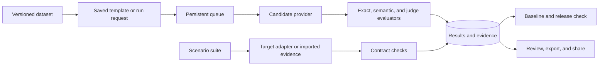

# Evaluation Engine

[](https://github.com/Ibrahimboudagga/evealuation-engine/actions/workflows/tests.yml)

**A workspace for agencies to test AI products, explain failures, and make evidence-based release decisions.**

Evaluation Engine turns versioned test data into auditable model, pairwise, and agent/application evaluations. Teams can compare a candidate with a baseline, separate quality failures from provider failures, review every example, and share a client-safe report without exposing credentials or unrelated projects.

The repository currently targets controlled agency pilots. It includes a FastAPI service, a Gradio operator interface, a persistent single-worker queue, SQLite for local development, PostgreSQL deployment support, and an explicit credential-free simulation mode.

> **Measurement principle:** a completed run means processing finished. It does not mean the AI passed. Release decisions use coverage, valid quality results, explicit thresholds, and compatibility checks.

## Contents

- [What it evaluates](#what-it-evaluates)
- [Why agencies can use it](#why-agencies-can-use-it)
- [How it works](#how-it-works)
- [Five-minute local demo](#five-minute-local-demo)
- [Agent and SaaS scenario evaluation](#agent-and-saas-scenario-evaluation)
- [Metrics, failures, and release decisions](#metrics-failures-and-release-decisions)
- [Providers and credentials](#providers-and-credentials)
- [API, CLI, and UI](#api-cli-and-ui)
- [CI/CD](#cicd)
- [Deployment](#deployment)
- [Testing](#testing)
- [Project map](#project-map)
- [Documentation](#documentation)
- [Current boundaries](#current-boundaries)

## What it evaluates

| Evaluation path | Best for | Evidence produced |
| --- | --- | --- |
| **Single-model evaluation** | Support bots, RAG answers, extraction, classification, and other prompt-to-answer features | Exact match, semantic similarity, optional LLM-judge scores, explanations, coverage, and per-example failures |
| **Pairwise evaluation** | Comparing two models, prompts, or product versions | `A`, `B`, or `tie` decisions, judge explanations, valid-comparison rates, win rates, and Elo summaries |
| **Agent and application scenarios** | Tool-using agents and the AI layer of an application or SaaS | Assertions over outputs, tool traces, retrieval evidence, state changes, side effects, multi-turn behavior, latency, and token checks |

The scenario path evaluates observable behavior against a declared contract. It can verify, for example, that an agent called an approved retrieval tool, returned required citations, avoided a forbidden side effect, updated state correctly, and completed within a latency budget. It does not automatically prove security, legal correctness, business value, or the truth of evidence supplied by the target application.

## Why agencies can use it

- **Client separation.** Workspaces contain client projects, dataset versions, runs, templates, reports, and audit events. Roles include `owner`, `editor`, `viewer`, and project-scoped `client_viewer` access.
- **Reproducible run records.** Each run stores the dataset version, candidate and judge settings, prompt or rubric, evaluator configuration, timeout, release rules, and simulation status.
- **Credential isolation.** Owners configure encrypted workspace provider connections once. Run requests and reports reference connection IDs and never return stored API keys.
- **Explicit simulation.** Mock behavior requires an explicit mock/demo selection, and every affected run and report is visibly marked simulated.
- **Failure-aware scoring.** Candidate failures become `generation_error`; judge or parser failures become `evaluation_error`. Neither is converted into an ordinary low score, loss, or tie.
- **Operational queue.** The embedded worker claims due runs, retries classified transient failures with backoff and jitter, supports cancellation and retry, dispatches daily or weekly schedules, and reports health.
- **Transparent client delivery.** Per-example review, CSV/JSON/HTML exports, project dashboards, and expiring revocable share links expose the evidence behind a result.
- **Release checks.** Compatible runs can be compared with a baseline using coverage, minimum sample size, average score, pass rate, evaluator-specific rules, and metadata slices.
- **Pilot controls.** Owners can inspect members, projects, templates, provider connections, usage, trial/billing metadata, worker health, notification preferences, activation milestones, and audit history from one console.

## How it works



The API creates the database run before returning its ID. That same ID follows the run through `queued`, `running`, and a terminal state. Results are stored incrementally, so completed work survives a process interruption. On a single-worker restart, unclaimed queued runs remain queued and abandoned running runs become `interrupted`.

## Five-minute local demo

### Requirements

- Python 3.11 or newer. CI currently exercises Python 3.11, 3.12, and 3.14.
- Git.
- No provider credential is needed for the explicit mock workflow.

### 1. Install

PowerShell:

```powershell
python -m venv .venv
.\.venv\Scripts\python.exe -m pip install --upgrade pip
.\.venv\Scripts\python.exe -m pip install -r requirements.txt
Copy-Item .env.example .env
```

macOS or Linux:

```bash
python3 -m venv .venv
./.venv/bin/python -m pip install --upgrade pip
./.venv/bin/python -m pip install -r requirements.txt
cp .env.example .env
```

Generate a Fernet key and place it in `.env` as `WORKSPACE_ENCRYPTION_KEY`:

```powershell
.\.venv\Scripts\python.exe -c "from cryptography.fernet import Fernet; print(Fernet.generate_key().decode())"
```

The default `.env.example` uses SQLite and `APP_ENVIRONMENT=development`.

### 2. Start the API and UI

Terminal 1:

```powershell
.\.venv\Scripts\python.exe -m uvicorn app.api.main:app --host 127.0.0.1 --port 8000
```

Terminal 2:

```powershell
.\.venv\Scripts\python.exe -m app.ui.gradio_app
```

Open [http://127.0.0.1:7860](http://127.0.0.1:7860). API documentation is available at [http://127.0.0.1:8000/docs](http://127.0.0.1:8000/docs).

### 3. Run the agency walkthrough

1. In **Setup Wizard**, create the first workspace owner with a password of at least 12 characters. A setup secret is required only in production.
2. In **Sign In**, enter the owner credentials.
3. In **Provider Connections**, create a connection named `Demo`, choose provider `mock`, use model `mock`, and enter `mock` in the API-key field. The value is stored encrypted and the resulting runs are marked simulated.
4. In **Agency Admin Console** or **Projects**, select **Seed Agency Demo**. This creates a sample client project and two versioned datasets.
5. In **Run Evaluation**, refresh the datasets and connections, choose the demo connection for both candidate and judge, and submit.
6. Use **View Results** and **Review Results** to inspect status, coverage, scores, explanations, and errors.
7. Use **Client Reports** to export the result. Mark a completed run as a baseline in **Release Checks**, then compare a later run.

For the shortest local engine check, run the sample dataset directly:

```powershell
.\.venv\Scripts\python.exe run_eval.py --dataset datasets/sample.jsonl --candidate-provider mock --candidate-model mock --evaluator-provider mock --evaluator-model mock
```

This CLI path is useful for development. The workspace UI/API path is the intended agency workflow.

## Agent and SaaS scenario evaluation

Scenario suites describe observable behavior rather than a single expected answer. A suite can check:

- output fields with JSON Pointer assertions;
- required and forbidden tools, call limits, order, arguments, and results;
- retrieved documents, citation identifiers, and reference-grounded claims;
- state before and after execution;
- declared side effects and observed authorization decisions;
- bounded multi-turn sequences;
- latency and reported token limits;
- typed domain evidence, including the included synthetic Revenue Ops contract.

Run the included SaaS fixture without credentials:

```powershell
.\.venv\Scripts\python.exe run_scenarios.py --adapter fixture --dataset datasets/scenarios/open_saas.jsonl --fixtures datasets/scenarios/fixtures.json --output-dir scenario-output/saas-demo
```

Every output directory must be new. The command writes:

- `manifest.json` with the pinned suite, target label, configuration, lifecycle, and metrics;
- `results.jsonl`, flushed after each example;
- `report.html`, an escaped local evidence report.

Exit code `0` means all fully evaluated cases passed, `1` means verified regressions were found, and `2` means the result was inconclusive.

For a trusted staging application, use the HTTP adapter or the legal-RAG adapter described in [SCENARIO_EVALUATION.md](SCENARIO_EVALUATION.md). The HTTP adapter sends a stable request ID and idempotency key, applies a bounded timeout, and can read a bearer token from a named environment variable. It does not retry remote agent execution because the target may perform side effects.

The workspace **Agent & App Scenarios** page supports immutable suite versions, imported evidence, local scoring, filtering, baseline comparison, HTML/JSON export, and fixed expiring report snapshots. Imported evidence is labeled as unverified provenance; the product does not claim it launched the remote agent.

## Metrics, failures, and release decisions

For each evaluator, the engine reports:

| Metric | Denominator |
| --- | --- |
| Total cases | Every expected case in the pinned dataset |
| Valid evaluations | Cases with outcome `evaluated` and a valid score |
| Generation errors | Cases where candidate execution failed |
| Evaluation errors | Cases where judging, parsing, or scoring failed |
| Evaluation coverage | Valid evaluations / total cases |
| Average score | Scores from valid evaluations only |
| Pass rate | Passing valid evaluations / valid evaluations |

If no case is valid, quality metrics are `null` and the UI reports **No valid evaluations**. Invalid pairwise comparisons are excluded from win rates and Elo calculations.

Run states and result outcomes are separate:

| Run status | Meaning |
| --- | --- |
| `queued` | Accepted and waiting for a due worker attempt |
| `running` | Processing examples |
| `completed` | Processing finished; inspect coverage, quality, and error counts |
| `failed` | A fatal error or exhausted retry budget prevented completion |
| `interrupted` | Execution stopped before completion, including user cancellation |

| Result outcome | Meaning |
| --- | --- |
| `evaluated` | A valid quality measurement exists |
| `generation_error` | The candidate response was unavailable |
| `evaluation_error` | The judge or evaluator did not produce a valid measurement |
| `unverified` | Historical evidence cannot safely be classified as a verified result |

Release comparisons return `passed`, `regressed`, or `inconclusive`. A comparison becomes inconclusive when contracts are incompatible, coverage is insufficient, there are too few valid cases, or required metrics are unavailable. Configuration snapshots include evaluator code fingerprints and backend details so silent scorer drift is visible.

## Providers and credentials

The provider factory supports:

- OpenAI;
- Anthropic;
- Google Gemini;
- Cohere;
- OpenAI-compatible endpoints, including explicitly configured compatible, Groq, and Hugging Face endpoints;
- the explicit `mock` / `demo` provider.

Unknown provider names and missing required credentials fail with a configuration error. Intentionally unauthenticated endpoints require the explicit compatible-provider setting plus a base URL. Remote authenticated custom endpoints must use HTTPS.

Workspace provider API keys are encrypted with `WORKSPACE_ENCRYPTION_KEY`, are never returned by the API, and are redacted from exports. Keep the encryption key stable and outside source control. Stored credential references are supported in the data model, but the deployment must supply an external secret resolver before they can be used.

## API, CLI, and UI

FastAPI's OpenAPI page at `/docs` is the canonical endpoint reference. Major route groups include:

| Area | Examples |
| --- | --- |
| Identity and access | `/auth/bootstrap`, `/auth/sign-in`, `/workspace/members`, project grants |
| Projects and data | `/projects`, `/datasets`, dataset versions and active-version selection |
| Evaluation | `/runs`, `/pairwise-runs`, cancel/retry actions, result review and exports |
| Reuse and automation | `/evaluation-templates`, `/schedules` |
| Decisions and delivery | baselines, comparisons, project dashboards, report shares |
| Agent/application evidence | `/scenario-suites`, `/scenario-runs`, scenario comparisons and shares |
| Operations | `/health`, `/health/live`, `/health/ready`, usage, audit, retention, activation, and billing metadata |

Authenticated API calls use `Authorization: Bearer <session token>` and the selected workspace context. Project grants further restrict client viewers. Public share tokens authorize only the frozen or scoped report they were created for.

The Gradio UI covers initial setup, individual sign-in, account administration, provider connections, templates, projects, schedules, usage, datasets, model runs, pairwise runs, agent/application scenarios, detailed review, reports, dashboards, and release checks.

## CI/CD

GitHub Actions validates pull requests with the full Python 3.11/3.12/3.14 test matrix, a PostgreSQL 16 migration and backup/restore rehearsal, and a startup probe of the production Compose stack. After those gates pass, pushes to `main` and `v*` tags build and smoke-test an exact container digest before promoting it with an SBOM, build provenance, and an artifact attestation in GitHub Container Registry. Pull requests have read-only permissions and cannot publish packages.

See [CI_CD.md](CI_CD.md) for image tags, release steps, branch protection, required GitHub settings, and the contract for adding a hosting-specific deployment stage.

## Deployment

The included Compose stack runs PostgreSQL 16, the API, and Gradio on loopback interfaces.

```powershell
Copy-Item .env.production.example .env
```

Set these values before starting:

- `POSTGRES_PASSWORD` — use a long URL-safe value because Compose inserts it into `DATABASE_URL`;
- `WORKSPACE_ENCRYPTION_KEY` — generate once with `Fernet.generate_key()` and retain it;
- `BOOTSTRAP_SECRET` — required by the production setup wizard.

Then run:

```powershell
docker compose up --build
```

The UI is bound to `127.0.0.1:7860` and the API to `127.0.0.1:8000`. Put an authenticated TLS reverse proxy in front of them for remote access. Configure `PUBLIC_API_BASE` for externally reachable scenario share URLs when it differs from the internal API address.

The current queue is designed for one API process with one embedded execution worker. Do not horizontally scale the API until worker ownership and distributed claims are implemented. Production startup rejects SQLite and missing security configuration. `/health/ready` checks configuration, database reachability, worker status, queue depth, backup freshness records, and overdue schedules.

Alembic upgrades the configured database during application startup. Before upgrading real client data, take a tested backup. The deployment rehearsal validates a fresh schema plus backup/restore row counts and content hashes; see [PILOT_REHEARSAL.md](PILOT_REHEARSAL.md).

## Testing

The default suite uses temporary SQLite databases and deterministic fake providers. It requires no real provider credentials and does not download a sentence-transformer model.

```powershell
.\.venv\Scripts\python.exe -m pytest -q --basetemp=.pytest_tmp/readme-check
```

Focused scenario checks:

```powershell
.\.venv\Scripts\python.exe -m pytest tests/test_scenarios.py tests/test_scenario_trace.py tests/test_scenario_redaction.py tests/test_workspace_scenarios.py -q --basetemp=.pytest_tmp/scenarios
```

CI runs the suite on Python 3.11, 3.12, and 3.14, starts PostgreSQL 16, applies migrations, executes a mock run, creates a database backup, restores it into a second database, and compares row counts and content hashes.

## Project map

```text
app/
  api/          FastAPI routes and request/response schemas
  database/     SQLAlchemy models, sessions, and Alembic integration
  evaluators/   Exact, semantic, LLM-judge, and pairwise evaluators
  providers/    Provider adapters and explicit provider validation
  runners/      Incremental single-model and pairwise execution
  scenarios/    Agent/application contracts, adapters, scoring, and reports
  services/     Identity, projects, queue, schedules, reports, usage, and audit
  ui/           Gradio agency interface
alembic/        Data-preserving schema migrations
datasets/       Text-evaluation samples and synthetic scenario fixtures
scripts/        Deployment smoke and restore verification
tests/          Unit, integration, migration, security, and workflow tests
```

## Documentation

| Document | Use it for |
| --- | --- |
| [DEMO_GUIDE.md](DEMO_GUIDE.md) | The short agency mock demonstration |
| [SCENARIO_EVALUATION.md](SCENARIO_EVALUATION.md) | Scenario schema, trace contracts, adapters, and reference projects |
| [PROJECT_DEEP_DIVE.md](PROJECT_DEEP_DIVE.md) | Detailed system architecture and feature inventory |
| [PROJECT_DOCUMENTATION.md](PROJECT_DOCUMENTATION.md) | Extended API and implementation documentation |
| [HOSTED_PILOT_ONBOARDING.md](HOSTED_PILOT_ONBOARDING.md) | Hosted pilot setup checklist |
| [PILOT_REHEARSAL.md](PILOT_REHEARSAL.md) | End-to-end operational rehearsal |
| [TESTING.md](TESTING.md) | Test environment and recorded dependency versions |
| [CI_CD.md](CI_CD.md) | Pipeline stages, image publication, and release operations |
| [REANALYSIS_REMEDIATION.md](REANALYSIS_REMEDIATION.md) | Latest feedback response, verification evidence, and remaining gaps |

## Current boundaries

This is a strong controlled-pilot foundation, with several deliberate boundaries:

- the execution queue is single-process and is not a distributed worker system;
- notification preferences are stored, but email and Slack delivery adapters are not implemented;
- billing fields and usage snapshots support manual pilots, but there is no payment-provider integration or billable provider-attempt ledger;
- scenario imports cannot independently prove that evidence came from the claimed deployment;
- hosted model aliases and downloaded embedding weights require operator-controlled pinning for strict reproducibility;
- production acceptance still requires deployment-specific proxy, browser-isolation, backup, restore, and real-provider exercises;
- the repository does not currently include a license file, so redistribution and commercial-use terms have not been granted.

These limits are tracked in [REANALYSIS_REMEDIATION.md](REANALYSIS_REMEDIATION.md). They keep reports honest: the engine shows what was measured, how it was measured, and which conclusions remain unverified.
